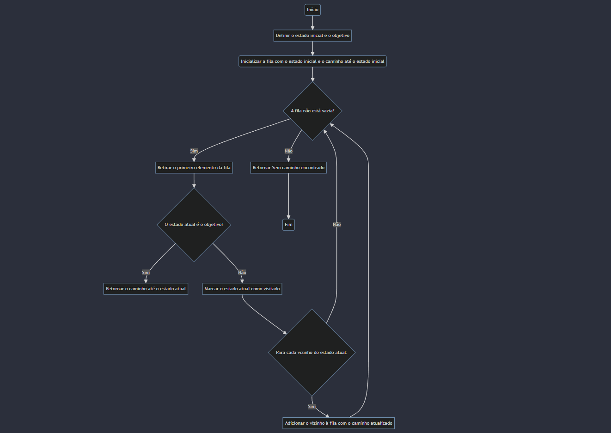

# Introdução à Busca em Largura (BFS) e sua Relação com Busca Cega
A busca em largura (BFS) é um dos algoritmos fundamentais em ciência da computação e inteligência artificial, usado principalmente em problemas de busca em grafos. É uma técnica sistemática que explora todos os nós vizinhos antes de seguir adiante, garantindo que o caminho encontrado seja o mais curto possível em grafos não ponderados.

## Funcionamento da BFS:
- **Inicialização**: A BFS começa definindo um estado inicial e um estado objetivo.
- **Exploração dos Vizinhos**: Em seguida, ela explora os vizinhos do estado inicial, expandindo para os vizinhos deles e assim por diante.
- **Fila de Nós a Serem Explorados**: A BFS utiliza uma fila para armazenar os nós a serem explorados. Ela insere o estado inicial na fila e continua retirando e explorando os nós da fila até encontrar o estado objetivo ou até que não haja mais nós para explorar.
- **Marcação de Estados Visitados**: Para evitar ciclos infinitos em grafos com ciclos, a BFS marca os estados já visitados.
- **Retorno do Caminho**: Quando encontra o estado objetivo, a BFS retorna o caminho até esse estado.
## Relação com Busca Cega:
A busca em largura é uma forma de busca cega, o que significa que ela não utiliza informações adicionais sobre o problema além da estrutura do próprio grafo. Ela explora o espaço de busca de forma sistemática, sem considerar a qualidade ou relevância das informações disponíveis em cada estado. Portanto, a BFS é uma técnica de busca cega porque não faz uso de heurísticas ou conhecimento adicional para guiar a exploração.

## Aplicações e Importância:
- A BFS é amplamente utilizada em uma variedade de problemas, incluindo navegação em labirintos, resolução de quebra-cabeças, roteamento de pacotes em redes de computadores e muito mais.
- Ela é particularmente útil em problemas nos quais é importante encontrar o caminho mais curto entre dois pontos, como encontrar a menor rota entre duas cidades em um mapa.
Em resumo, a busca em largura é uma técnica poderosa e versátil em inteligência artificial e ciência da computação, permitindo a resolução eficiente de uma ampla gama de problemas de busca em grafos.


# Algoritmo de Exemplo:
```
from collections import deque

class Ambiente:
    def __init__(self, grafo):
        self.grafo = grafo
    
    def get_vizinhos(self, estado):
        return self.grafo[estado]

class Agente:
    def __init__(self, ambiente, estado_inicial, objetivo):
        self.ambiente = ambiente
        self.estado_inicial = estado_inicial
        self.objetivo = objetivo
    
    def buscar_objetivo(self):
        fila = deque([(self.estado_inicial, [self.estado_inicial])])
        visitados = set()

        while fila:
            estado_atual, caminho = fila.popleft()
            if estado_atual == self.objetivo:
                return caminho
            
            if estado_atual not in visitados:
                visitados.add(estado_atual)
                vizinhos = self.ambiente.get_vizinhos(estado_atual)
                for vizinho in vizinhos:
                    fila.append((vizinho, caminho + [vizinho]))
        
        return None

# Exemplo de uso
grafo = {
    'A': ['B', 'C'],
    'B': ['D', 'E'],
    'C': ['F'],
    'D': [],
    'E': ['F'],
    'F': []
}

ambiente = Ambiente(grafo)
agente = Agente(ambiente, 'A', 'F')
caminho = agente.buscar_objetivo()

if caminho:
    print("Caminho encontrado:", caminho)
else:
    print("Não foi possível encontrar um caminho para o objetivo.")

```
## Classe Ambiente:
    - Esta classe representa o ambiente onde o agente opera, neste caso, um grafo.
    - __init__(self, grafo): O construtor recebe o grafo como entrada e o armazena para uso posterior.
    - get_vizinhos(self, estado): Retorna os vizinhos de um estado específico no grafo.


## Classe Agente:
    - A classe Agente é responsável por encontrar um caminho do estado inicial para o estado objetivo no ambiente (grafo).
    - __init__(self, ambiente, estado_inicial, objetivo): O construtor recebe uma instância da classe Ambiente, um estado inicial e um estado objetivo para o agente encontrar.
    - buscar_objetivo(self): Este método implementa a busca em largura para encontrar um caminho do estado inicial para o estado objetivo no grafo.

## Uso do deque:
    - O deque é uma estrutura de dados de fila de dupla extremidade.
    - Foi utilizado para manter a ordem de inserção e remoção eficientes, especialmente para operações de popleft(), que são cruciais para o algoritmo de busca em largura.
    - Em vez de usar uma lista padrão para implementar a fila, o deque é preferido devido à sua eficiência em inserções e remoções em ambas as extremidades.


  