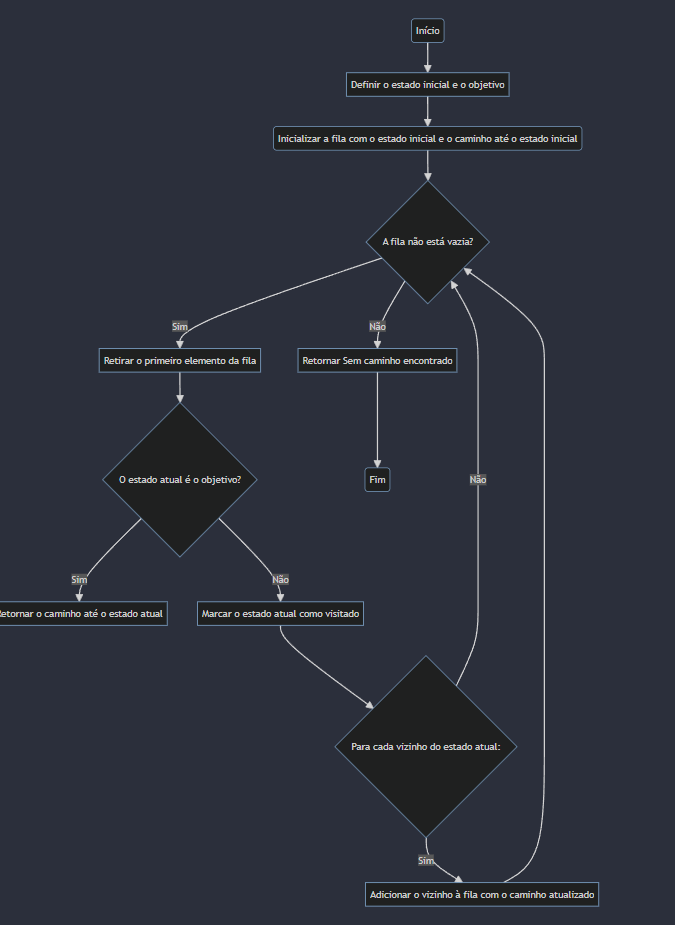

# Introdução à Busca em Largura (BFS) e sua Relação com Busca Cega
A busca em largura (BFS) é um dos algoritmos fundamentais em ciência da computação e inteligência artificial, usado principalmente em problemas de busca em grafos. É uma técnica sistemática que explora todos os nós vizinhos antes de seguir adiante, garantindo que o caminho encontrado seja o mais curto possível em grafos não ponderados.

## Funcionamento da BFS:
- **Inicialização**: A BFS começa definindo um estado inicial e um estado objetivo.
- **Exploração dos Vizinhos**: Em seguida, ela explora os vizinhos do estado inicial, expandindo para os vizinhos deles e assim por diante.
- **Fila de Nós a Serem Explorados**: A BFS utiliza uma fila para armazenar os nós a serem explorados. Ela insere o estado inicial na fila e continua retirando e explorando os nós da fila até encontrar o estado objetivo ou até que não haja mais nós para explorar.
- **Marcação de Estados Visitados**: Para evitar ciclos infinitos em grafos com ciclos, a BFS marca os estados já visitados.
- **Retorno do Caminho**: Quando encontra o estado objetivo, a BFS retorna o caminho até esse estado.
## Relação com Busca Cega:
A busca em largura é uma forma de busca cega, o que significa que ela não utiliza informações adicionais sobre o problema além da estrutura do próprio grafo. Ela explora o espaço de busca de forma sistemática, sem considerar a qualidade ou relevância das informações disponíveis em cada estado. Portanto, a BFS é uma técnica de busca cega porque não faz uso de heurísticas ou conhecimento adicional para guiar a exploração.

## Aplicações e Importância:
- A BFS é amplamente utilizada em uma variedade de problemas, incluindo navegação em labirintos, resolução de quebra-cabeças, roteamento de pacotes em redes de computadores e muito mais.
- Ela é particularmente útil em problemas nos quais é importante encontrar o caminho mais curto entre dois pontos, como encontrar a menor rota entre duas cidades em um mapa.
Em resumo, a busca em largura é uma técnica poderosa e versátil em inteligência artificial e ciência da computação, permitindo a resolução eficiente de uma ampla gama de problemas de busca em grafos.

# Algoritmo de Exemplo:
## Classe Ambiente:
- A classe Ambiente representa o grafo no qual a busca será realizada.
    - O método __init__ inicializa o ambiente com o grafo fornecido como entrada.
    - O método get_vizinhos retorna uma lista de vizinhos de um estado dado.
## Classe Agente:
- A classe Agente representa o agente que executa a busca em largura.
    - O método __init__ inicializa o agente com o ambiente, o estado inicial e o estado objetivo.
    - O método buscar_objetivo executa a busca em largura.
    - Ele usa uma fila para armazenar os estados a serem explorados, juntamente com o caminho até esse estado.
    - Enquanto a fila não estiver vazia, o algoritmo retira o primeiro estado da fila.
    - Se o estado atual for o objetivo, retorna o caminho até esse estado.
    - Caso contrário, marca o estado como visitado, obtém os vizinhos não visitados desse estado e os adiciona à fila com o caminho atualizado.
    - Se a fila se esvaziar sem encontrar o objetivo, retorna None.

  